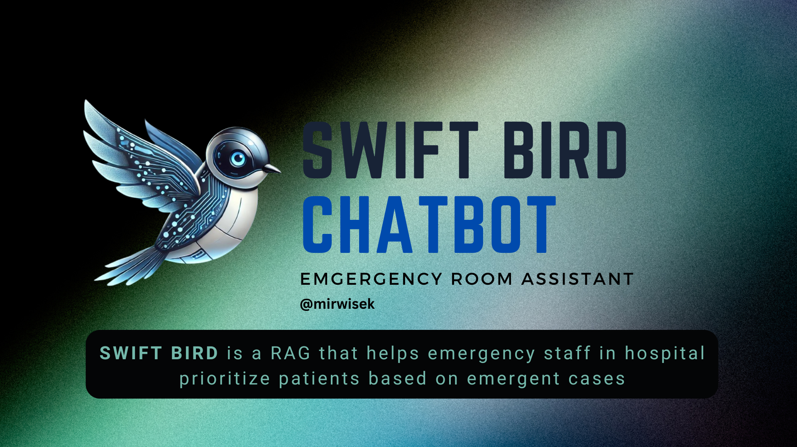

### Swift Bird - Emergency Room Assistant [CHATBOT]

**Swift Bird** is an AI-powered tool designed to assist hospital emergency staff in prioritizing patients with urgent needs. It leverages a **Retrieval-Augmented Generation (RAG)** approach, which combines generating responses with retrieving relevant medical context from external, open-source datasets.

The system is built on the **Mistral Large** language model and can interact in multiple languages, including **English, French, and Spanish**. It supports voice interaction using **speech-to-text** and **text-to-speech** technologies, allowing patients to communicate naturally by speaking to the chatbot. Based on the interactions, Swift Bird helps emergency staff quickly identify and preselect patients who need immediate medical attention, making the triage process faster and more efficient.

